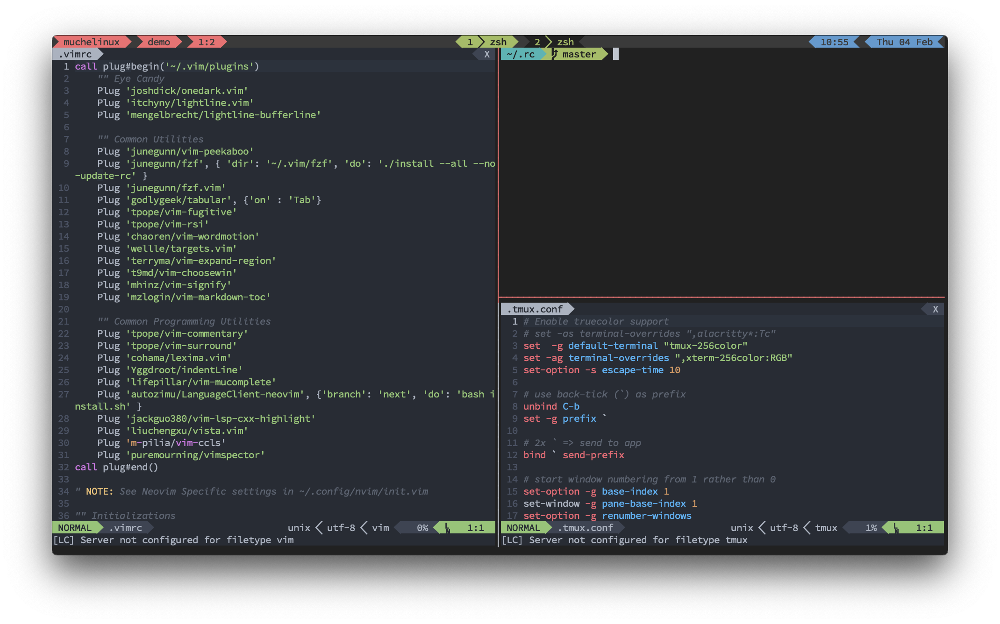

# dotRC

My shell environment to setup and manage my CLI IDE.



## Quick Start

```sh
git clone http://github.com/harshasrisri/dotRC.git ~/.rc
cd ~/.rc
./setup
```

Running `./setup` will symlink dotfiles to `$HOME` and install plugin managers for neovim, tmux, and zsh.

**Backup your existing configurations before running setup.**

## What's Included

- **[WezTerm](./dot/config/wezterm/)** - GPU-accelerated terminal with 120 FPS, modular Lua config
- **[Zsh + Zim](./dot/config/zim/)** - Modern shell with fzf integration, smart completions, and custom functions
- **[Tmux](./dot/config/tmux/)** - Terminal multiplexer with backtick leader key and SSH-aware clipboard
- **[Neovim](./dot/config/nvim/)** - LSP/TreeSitter-enabled editor with lazy loading and modular plugins
- **[Vim](./dot/config/vim/)** - Legacy config, minimal usage
- **[Git](./dot/config/git/)** - Performance-optimized git configuration
- **[KMonad](./dot/config/kmonad/)** - Custom keyboard layouts for ergonomic typing
- **[Utility Scripts](./dot/local/bin/)** - Shell scripts for clipboard, fzf, and workflow automation

Each component has its own README with detailed documentation.

## Key Features

- Unified backtick (`) leader key across WezTerm and tmux
- Performance-optimized configurations (git, fzf, shell)
- Modern CLI tools: `bat`, `eza`, `fd`, `rg`, `fzf`, `zoxide`
- Works seamlessly locally and over SSH
- Modular, maintainable configuration structure

## Quick Reference

Core utilities and aliases defined in [dot/myenv](./dot/myenv):
- `fvi` - FZF file picker with preview
- `frg` / `frgv` - Interactive ripgrep with editor opening
- `tm <session>` - Quick tmux session management
- `.n` / `.w` / `.t` - Edit neovim/wezterm/tmux configs
